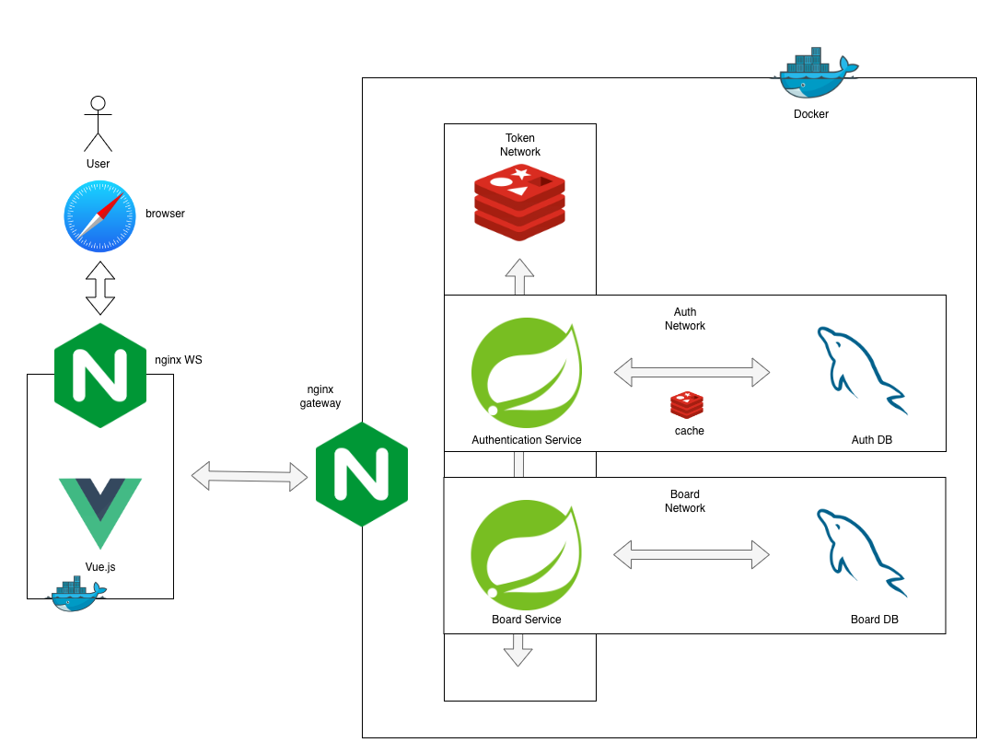

# iknow-authentication-server
프로젝트의 인증과 인가를 담당하는 서버입니다.

REST API를 제공하며, 클라이언트는 이 서버를 통해 사용자의 인증과 인가를 처리합니다. 
프론트엔드는 포함되어 있지 않으며 별도 [레포지토리](https://github.com/iknowca/iknow-main-frontend)에서 구현하였습니다.
## 서버 구조

## 서버 주요 관심사
- **사용자 인증/인가** 
  Spring Security를 일관된 방식으로 사용하여 사용자의 인증과 인가를 처리합니다.

- **문서화** 
  Notion을 사용하여 [API 명세서](https://colorful-chimpanzee-429.notion.site/API-Docs-2b32109a1bcd4b9a943d0c758eb6666f?pvs=4)를 작성하였습니다. 
  Mermaid를 사용하여 기능의 흐름을 Sequence Diagram, Flow Chart로 작성하였습니다.

- **테스트** 
  1. 기능 테스트  
  Junit5, Mockito를 사용하여 테스트 코드를 작성하였습니다. 
  초기에는 test double을 사용한 고립 테스트로 시작하였지만, 
  잦은 API설계 변경에 대응하기 위해 production object를 사용한 통합 테스트로 변경하였습니다.  
  2. 부하 테스트 
  nGrinder와 POSTMAN을 사용하여 부하 테스트를 수행하였습니다.

- **배포 자동화** 
Github Actions를 사용하여 CI/CD를 구축하였습니다. 
Main 브랜치에 push가 되면 testcontainer를 사용해 테스트를 수행하고, 테스트가 성공하면 빌드를 수행합니다. 
빌드가 성공하면 SCP 액션을 통해 서버로 빌드파일을 복사하고 서버에서 복사된 빌드 파일을 Docker 이미지로 제작하여 container로 실행시킵니다. 
 

- **Gateway** 
  nginx를 사용하여 API Gateway를 구축하였습니다. 
  
## 프로젝트 아키텍쳐

[auth-server](https://github.com/iknowca/iknow-authentication-server)는 프로젝트의 인증과 인가를 담당하는 서버입니다. 
[board-server](https://github.com/iknowca/board-server)는 게시글을 담당하는 서버입니다. 
[main-frontend](https://github.com/iknowca/iknow-main-frontend)는 프론트엔드입니다. 
